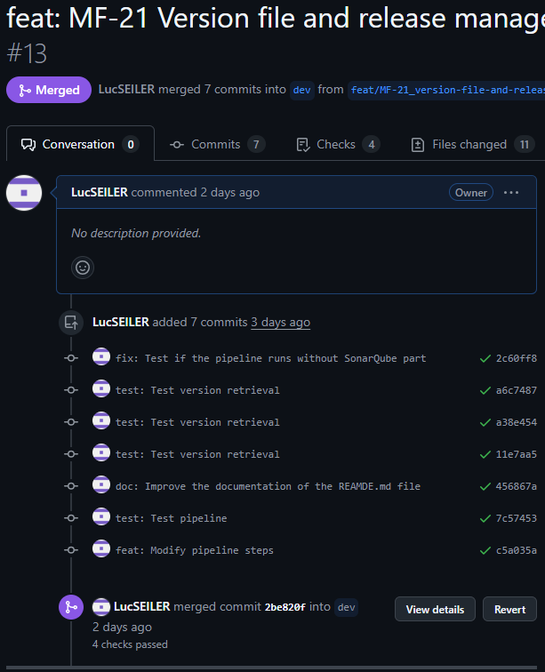
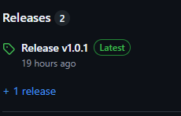
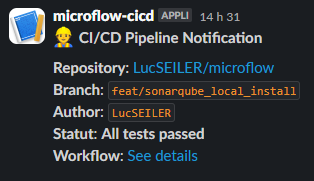

# microflow - CI/CD Strategy

This README explains how is composed the project, and how it works. It also explains how to use the pipelines and other tools integrated to it.

## Table of Contents

1. [Requirements](#requirements)
2. [Getting Started](#getting-started)
    - [How to install SonarQube](#how-to-install-sonarqube)
    - [Create the project](#create-the-project)
3. [Strategy - Tools](#strategy---tools)
    - [SonarQube](#sonarqube)
    - [GitHub](#github)
    - [GitHub Action](#github-action)
    - [Jira](#jira)
    - [Slack](#slack)
    - [Docker](#docker)
4. [Strategy - Git](#strategy---git)
    - [Git - Branch organization](#git---branch-organization)
    - [Git - Start a new feature](#git---start-a-new-feature)
    - [Git - Pull Requests (PR)](#git---pull-requests-pr)
    - [Git - Make a new release](#git---make-a-new-release)
5. [Pipelines - How it works ?](#pipelines---how-it-works)
    - [build-and-test.yml](#build-and-testyml)
    - [release.yml](#releaseyml)

## Requirements

Before to start, be sure to have installed :

- `git` with `git flow`
- `docker` and `docker compose`
- `sonar-scanner`
- A version of `node` >= 20

## Getting Started

To run the app, use this command on the root directory :

```
docker compose up -d
```

Then use this command to see the current running images :

```
docker ps
```


You should see the two images running (backend and webapp). Now you should be able to have access to the API and the Front part from `localhost:3000` and `localhost:8000`


### How to install SonarQube

This project integrate a local version of SonarQube, used for code review and analyze. Here the local version is running with a `docker-compose` file present in the [./sonarqube-docker-compose](./sonarqube-docker-compose/) folder.

Just use the command when you're in :

```
docker compose up -d
```

Then wait until SonarQube is loaded, and go to `localhost:9000`.

> username : admin

> password : admin

Change your password, and get ready to create the project.

### Create the project

Create a local project. Then select local analyze, and generate a token. Save it in a file. And then use the command being sure to replace with your personal token :

```
sonar-scanner.bat -D"sonar.login=[your_token]"
```

You should have this interface :


If it's ok, the code has been correctly analyzed !

Because of a local installation of SonarQube, I am not able to integrate this part to the pipeline. That's why the command has to be done before a pull Request :

```
sonar-scanner.bat -D"sonar.login=[TOKEN]"
```

## Strategy - Tools

### SonarQube

SonarQube is an analyze tool helping the developers to **detect potential quality and security problems** is their code. For example :

- Bugs/Potential errors
- Bad development practices
- Unit test cover
- And more...

It provides a dashboard to show all the infos.


### Github

Usage of Github to **manage the source code**.

- Allow to view, manage and share code, and collaborate with the other developers.
- Allow to create different branches corresponding to a feature, a fix, etc...
- Allow PR (Pull Requests) to validate the code with reviews, and ensure code quality

### Github Action

Here, Github Actions is used to **manage all the project pipeline**, using .yaml files (in [./github/workflows](./.github/workflows/)).

This pipeline allowing :

- Automatic build & test for each commit, to ensure code quality before a push
- A local code quality cover on SonarQube
- Image creation with Docker, and Hub pushing
- Docker images deployment on a VPS server

### Jira

Jira allow to **manage all the backlog tasks**. This tool has a good management system. We can create a task architecture like :

- Project
- Epic tasks (global task to complete the project/the sprint)
- Tickets (all the tasks needed to complete an epic task)

This tool is fully adapted for an Agile working apporach, and allow to separate all the tasks in **Sprints** in the backlog

Also, Jira can be connected with other applications, like Github/Gitlab, Teams, etc...

Here, this repo is linked to the organization Jira board.


#### Jira - Usage

To create task(s), go to the list and create a ticket like this :


Then you can see thel to the board.

Connecting to Github, Jira has the possibility to be linked to :

- Commits
- Branches
- Pull Requests (PR)
- Build

Linked with a task. It is important to take care of this. See the Github branch management to see how to use it correctly.

### Slack

Integrating Slack with GitHub Actions offers several benefits, enhancing workflow efficiency, collaboration, and real-time monitoring.

This application allow **real time notifications, for example in the pipeline, for the test, and deployments**. Developers and project managers can stay informed about the project progress.

We can create multiple canals managing one part : test, deployment on dev, deployment on prod, etc... And be informed of all the potential errors to correct them faster.

### Docker

Usage of Docker, a powerful tool for **creating, deploying, and managing containerized applications**.

Docker ensures consistency between various environments, to make the application working for every king of environment.

#### Docker - Usage

Each part of the app (./backend/ and ./webapp/) have a `Dockerfile` created, managing the build steps. In the root directory, a `docker-compose.yml` is present, to create the images and run them.

## Strategy - Git

The Github repository is separeted in two parts :

- backend -> the API
- webapp -> the front serving the API

### Git - Branch organization

Here a the branches used :

- `main` -> Containing the source code of the production application
- `dev` -> Containing the new functionnalities for a new version of the app
- `feat` -> A new feature to include in the dev branch
- `fix` -> Correct a malfunction from an existing feature
- `release` -> Containing the next part of the code to release, after all the new features merges to the dev branch

**The main branch and the dev branch are protected from incoming push, to ensure security. These branches are updated only with a Pull Request (PR), with a reviewer required**


### Git - Start a new feature

An important point is the consideration of the JIRA connection with this repo. To be sure to have a good follow-up of the developement progress, JIRA use a `key system` to link all the commits, pull requests from Github.

In this project, the key is **MF**. Example :

In the backlog, you create the task `User management with password`, this will create a ticket starting with the key `MF-` followed by the next number available for the ticket. If the last ticket is `MF-52`, the created one will be `MF-53`.

Then to create the new feature branch, you have two options :

- Traditional
- Using Git flow (see install)

Go to the dev branch, and be sure to have pull all the last version. Then use this feature template name `feat/SM-[ticket_number]_name_of_the_feature`. For example with the command :

```
git checkout -b feat/MF-53_user_management_with_password
```

With git flow use :

```
git flow feature start MF-53_user_management_with_password
```

This will create a new branch called feat/MF-53_user_management_with_password and will go directly on it.

Then you are able to start developing the new feature ! And all the progress will be visible to the JIRA board, if the key is present.


### Git - Pull Requests (PR):

After finish, go to Github to start a Pull Request for your feature to be merged into dev.



At least 1 reviewers required to validate a PR to develop and main branches. Then you will be able to merge your work to `dev`.

### Git - Make a new release

There is 3 sorts of releases :

> Major Release (X.0.0) – Introduces new features, structural changes that are not backward compatible.

- Example: 1.0.0 → 2.0.0
- You plan to make a major release every year.

> Minor Release (X.Y.0) – Adds new features, but don't breack the compatibility with other versions.

- Example: 1.1.0 → 1.2.0
- At least one per quarter

> Patch Release (X.Y.Z) – Includes bug fixes and small improvements without adding new features.

- Example: 1.1.1 → 1.1.2

To make a new release, first tap this command using **git flow**:

```
git flow release start v[VERSION]
```

Replace version by X.Y.Z. This will :

- Create a new branch called release/v[VERSION], based on the dev branch
- Redirect you to the new branch

Then update the `CHANGELOG.md` file containing all the new features/fixes and other. An example for a release is the followind one:

```
## [1.0.0] - 2025-02-08

### What's new ?

- Integration of backend and webapp
- Integration of SonarQube
- Documentation improvements

### Technical adjusments

- Pipeline adjusments
```

**DO NOT delete previous version, to keep a clean history !**

If you have some issues to correct, to can do it like all the other banch, with
`commit - push`

After you think all is ready for the new release, tap the command :

```
git flow release finish v[VERSION]
```

This will:

- Push to your local dev branch
- Push to your local main branch
- Create a local tag (ex: v1.0.0)
  commit - push
- Delete the release branch
- Checkout to the dev branch

In this process, git flow will ask you to put some commit/release messages. Follow the step, and the release will take effect.

The release is done locally, but to make it into Github, follow this :
```
git push origin dev
git push origin main
git push origin --tags
```

After this, the `release` pipeline will start to manage the process : Docker, deployment, TAG release... If all the pipeline is passed, the release is done.

You can see it in Github :



And if you click on it, youu can see the last changes contained in the `CHANGELOG.md` file :


## Pipelines - How it works ?

There are two pipelines in the `.github/workflows` folder.

### build-and-test.yml

This pipeline is started **after each commit - push** in a branch (except dev and main). 

Once activated, it :
* Build backend and launch the tests
* Notify the result on Slack



### release.yml

This pipeline is activated **after a new release tag in created**. It :
* Creates a new release tag, based on the CHANGELOG.md file
* Push the two images (backend/webapp) into Docker Hub
* Deploy on production on a personal VPS
* Notify on the new release


Because of a local installation of SonarQube, I am not able to integrate this part to the pipeline. That's why the command has to be done before a pull Request :

```
sonar-scanner.bat -D"sonar.login=[TOKEN]"
```
