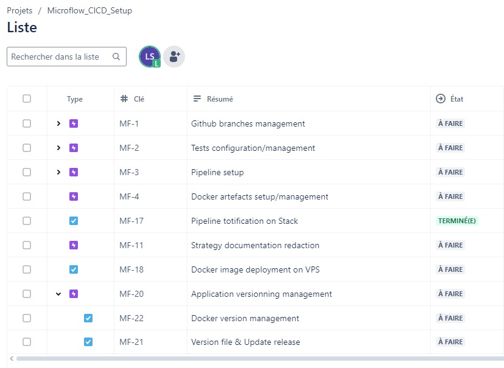
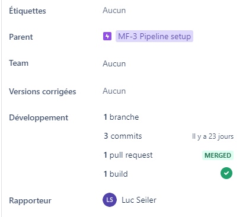

# microflow-cicd - CI/CD Strategy

## Getting Started

You can run the app by using this command on the root directory : 
```
docker compose up -d
```

Then use this command to see the current running images :
```
docker ps
```


Now you should be able to have access to the API and the Front part from `localhost:3000` and `localhost:8000`


### How to install SonarQube

This project use a local version of SonarQube, used for code review and analyze. Here the local version is running with a `docker-compose` file present in the [./sonarqube-docker-compose](./sonarqube-docker-compose/) folder.

Just use the command when you're in : 
```
docker compose up -d
```

Then wait until SonarQube is loaded, and go to `localhost:9000`. 

> username : admin

> password : admin

Now change your password, and get ready to create the project.

### Create the project

First create a local project. Then select local analyze, and generate a token. Save it in a file. And then use the command being sure to replace with your personal token :
```
sonar-scanner.bat -D"sonar.login=[your_token]"
```

You should have this interface :


## Strategy - Tools

### SonarQube

SonarQube is an analyze tool helping the developers to **detect potential quality and security problems** is their code. For example :
* Bugs/Potential errors
* Bad development practices
* Unit test cover
* And more...

It provides a dashboard to show all the infos.


### Github

Usage of Github to **manage the source code**. 

* Allow to view, manage and share code, and collaborate with the other developers.
* Allow to create different branches corresponding to a feature, a fix, etc...
* Allow PR (Pull Requests) to validate the code with reviews, and ensure code quality

### Github Action

Here, Github Actions is used to **manage all the project pipeline**, using .yaml files (in [./github/workflows](./.github/workflows/)).

This pipeline allowing :
* Automatic build & test for each commit, to ensure code quality before a push
* A local code quality cover on SonarQube
* Image creation with Docker, and Hub pushing
* Docker images deployment on a VPS server

### Jira

Jira allow to **manage all the backlog tasks**. This tool has a good management system. We can create a task architecture like : 
* Project 
* Epic tasks (global task to complete the project/the sprint) 
* Tickets (all the tasks needed to complete an epic task)

This tool is fully adapted for an Agile working apporach, and allow to separate all the tasks in **Sprints** in the backlog

Also, Jira can be connected with other applications, like Github/Gitlab, Teams, etc...

Here, this repo is linked to the organization Jira board.


#### Jira - Usage

To create task(s), go to the list and create a ticket like this :



Then you can see thel to the board.

Connecting to Github, Jira has the  possibility to be linked to :
* Commits
* Branches
* Pull Requests (PR)
* Build

Linked with a task. It is important to take care of this. See the Github branch management to see how to use it correctly.

### Slack

Integrating Slack with GitHub Actions offers several benefits, enhancing workflow efficiency, collaboration, and real-time monitoring. 

This application allow **real time notifications, for example in the pipeline, for the test, and deployments**. Developers and project managers can stay informed about the project progress.

We can create multiple canals managing one part : test, deployment on dev, deployment on prod, etc... And be informed of all the potential errors to correct them faster.

### Docker

Usage of Docker, a powerful tool for **creating, deploying, and managing containerized applications**.

Docker ensures consistency between various environments, to make the application working for every king of environment.

#### Docker - Usage

Each part of the app (./backend/ and ./webapp/) have a Dockerfile created, managing the build steps. In the root directory, a `docker-compose.yml` is present, to create the images and run them.

### Strategy - Git

The Github repository is separeted in two parts :
* backend -> the API
* webapp -> the front serving the API

#### Git - Branch organization

Here a the branches :

* ``main`` -> Containing the source code of the production application
* ``dev`` -> Containing the new functionnalities for a new version of the app
* ``feat`` -> A new feature to include in the dev branch
* ``fix`` -> A branch to correct a malfunction from an existing feature
* ``release`` -> A branch containing the next part of the code to release, after all the new features merges to the dev branch

**The main branch and the dev branch are protected from incoming push, to ensure security. These branches are updated only with a Pull Request (PR)**


The code of the PR have to be reviewed by at least 1 reviewer.

#### Git - Start a new feature

An important point is the consideration of the JIRA connection with this repo. To be sure to have a good follow-up of the developement progress, JIRA use a `key system` to link all the commits, pull requests from Github.

**In this project, the key is MF**. Example : 

In the backlog, you create the task `User management with password`, this will create a ticket starting with the key `MF-` followed by the next number available for the ticket. If the last ticket is `MF-52`, the created one will be `MF-53`.

Then to create the new feature branch, you have two options :
* Traditional
* Using Git flow (see install)

Go to the dev branch, and be sure to have pull all the last version. Then use this feature template name `feat/SM-[ticket_number]_name_of_the_feature`. For example with the command : 
```
git checkout -b feat/MF-53_user_management_with_password
```

With git flow use :
```
git flow feature start MF-53_user_management_with_password
```

This will create a new branch called feat/MF-53_user_management_with_password and will go directly on it.

THen you are able to start developing the new feature ! And all the progress will be visible to the JIRA board.




#### Git - Pull Requests (PR):

At least 1 reviewers required to validate a PR to develop and main branches.

### Strategy - Release

There is 3 sorts of releases :

> Major Release (X.0.0) – Introduces new features, structural changes that are not backward compatible.

* Example: 1.0.0 → 2.0.0
* You plan to make a major release every year.

> Minor Release (X.Y.0) – Adds new features, but don't breack the compatibility with other versions.

* Example: 1.1.0 → 1.2.0
* At least one per quarter

> Patch Release (X.Y.Z) – Includes bug fixes and small improvements without adding new features.

* Example: 1.1.1 → 1.1.2

To make a new release:

TODO
